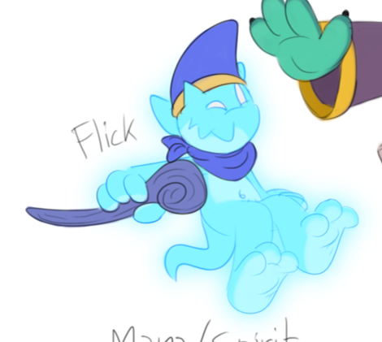

# Expanded ideas

* Different starting point: blancs, based on Azelgard's servants (cardworld)
* Generic and with lowest starting stats
  * Not even sure if upgradeable
  * Relatively cheap cost and no maintenance

* Other species need to be unlocked via buildings

# Existing species

* Demonlings need their portal
* Fufflebugs need their nest
* Bundelions need their burrow
* N'voii need their obelisk
* Stonautos need their ruins

# New species
* Blancs, based on Azelgard's servants (cardworld), start with their study hall 

* Earthen, earth species based on Oskar's minions (cardworld), need their dungeon

* Espers, based on Flick (cardworld), need their mana tree

* Voidkin, based on Sid and Void (cardworld) and other black-mage look-a-likes, need their altar

* Jubbies, based on Lloyd (cardworld), need their treehouse

* Flans, based on Redd (cardworld) and slimes in general, need their pond

* Goyles, based on Gale (cardworld) and gargoyles, need their crypt

* Gobkin, based on a little guy drawn on the same page as Mechior and general goblins, need their hut

* Krogs, tough scalies based on Sully (cardworld), need their cavern

* Pillowogs, playful critters based on Bill and Trip (cardworld), need their garden

* Xalfos, lizarmen based on Lucius (cardworld), need their marsh

